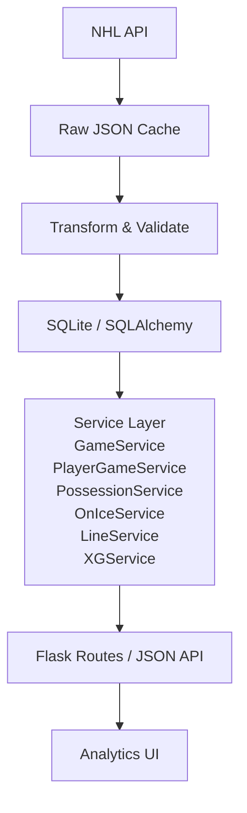

# NHL Hockey Analytics Platform

[](https://github.com/david-turnbull/Hockey-game-analyzer/actions/workflows/tests.yml)

**Current Release:** `v1.1.0`

Hockey Game Analyzer is an independent hockey-operations analytics platform that transforms raw NHL play-by-play and shift data into reproducible game, player, lineup, possession, and spatial analysis.

The project is designed as both a hockey analytics tool and a portfolio demonstration of data ingestion, relational modelling, analytical service design, testing, visualization, and reproducible sports analysis.

---

## What the platform does

- **Game analysis** — team boxscore comparisons, scoring/penalty timelines, and game-level dashboards.
- **Interactive shot mapping** — spatial visualization of goals, saves, misses, and blocked attempts with game/player filters.
- **Player game analysis** — player-specific boxscore statistics, possession metrics, shot maps, shift data, and prototype xG.
- **Shift reconstruction** — aligns NHL shift-chart data with play-by-play timing using consistent half-open interval semantics.
- **True 5v5 possession** — Corsi and Fenwick calculations restricted to complete 5v5 play.
- **5v5 forward combinations** — observed forward trios with shared TOI and on-ice GF/GA/SF/SA.
- **Defensive pairings** — defenseman duos with shared TOI and on-ice GF/GA/SF/SA.
- **Prototype expected goals (xG)** — transparent heuristic shot-quality estimates using distance, angle, shot type, and manpower context.
- **Shared 5v5 combination drill-down** — Clickable forward lines and defensive pairings details dashboard showing shared shifts, on-ice events, Corsi/Fenwick statistics, and Plotly shot maps.
- **Side-by-side player comparisons** — Side-by-side single-game performance comparison dashboard with situation filters and dual Plotly maps.
- **Standardized metric explanations** — Help tooltip hovers explaining advanced stats (Corsi, Fenwick, xG) across the platform.
- **Full-season ingestion** — Ingest a team's regular-season schedule using the same validated game pipeline.
- **Automated regression testing and CI** — Analytical edge cases and historical attribution are covered by `pytest` and GitHub Actions.

---

## Screenshots

### Game Selection Dashboard

Select an ingested season and team, then open any available game for analysis.


### Game Summary

Game-level team statistics, scoring and penalty timeline, final score, and user-friendly game status.


### Interactive Shot Map

Explore all shot attempts by team, player, period, outcome, and strength state.


### 5v5 Forward Combinations & Defensive Pairings

Observed 5v5 forward trios are shown when they record at least 1:00 of shared true-5v5 TOI. Defensive pairings are reported separately.


### Player Game Page

Player-level game statistics, TOI, possession metrics, and prototype expected goals.


### Player Shot & Shift Visualization

Individual shot attempts and period-by-period shift deployment.


---

## Architecture & Data Flow



The application intentionally separates ingestion, persistence, analytics, and presentation. Raw NHL status values and source records are preserved internally, while user-friendly presentation logic is handled separately.

---

## Features & Capabilities

### NHL API ingestion

The ingestion pipeline downloads NHL play-by-play and shift-chart data, caches the raw responses locally, transforms the feeds into relational records, validates the resulting data, and loads it into SQLite.

Core entities include:

- Teams
- Players
- Games
- Game rosters (`GamePlayer`)
- Events
- Shots
- Shifts

Historical game-roster attribution is treated as authoritative so players remain associated with the correct team for the game being analyzed, even after later trades.

### Game overview and event timeline

Each analyzed game includes:

- final score and status
- shots on goal
- goals
- shooting percentage
- faceoff percentage
- penalty minutes
- power-play goals
- prototype xG
- chronological goals and penalties

### Interactive shot maps

Shot attempts can be filtered by:

- team
- player
- period
- outcome
- strength state

The rink can also normalize attack direction to make spatial comparisons easier.

### True 5v5 possession

Corsi and Fenwick calculations use reconstructed on-ice state and explicitly exclude non-5v5 situations.

Player-level possession outputs include:

- CF / CA
- CF%
- FF / FA
- FF%

### 5v5 forward combinations

The line-combination service reconstructs observed forward trios from shift data.

For a second to count as true 5v5:

- both teams must have exactly five skaters
- each side must contain exactly three recognized forwards
- each side must contain exactly two recognized defensemen
- empty-net and malformed manpower states are excluded

Forward combinations below **60 seconds** of shared 5v5 TOI are filtered out. This removes transient line-change combinations while retaining meaningful in-game line juggling.

### Defensive pairings

Defenseman duos are reconstructed from the same on-ice timeline and reported with:

- TOI
- GF
- GA
- SF
- SA

### Player game analysis

Player pages include:

- goals
- assists
- points
- shots on goal
- hits
- penalty minutes
- faceoff win percentage where applicable
- valid shifts
- TOI
- prototype xG
- 5v5 Corsi/Fenwick
- individual shot visualization
- shift visualization

---

## Analytical Definitions

### Corsi

Corsi measures all shot attempts:

- goals
- saved shots
- missed shots
- blocked shots

For percentage:

```text
CF% = CF / (CF + CA) × 100
```

### Fenwick

Fenwick measures unblocked shot attempts:

- goals
- saved shots
- missed shots

For percentage:

```text
FF% = FF / (FF + FA) × 100
```

### True 5v5

A true-5v5 second requires complete five-skater deployment for both teams. Power plays, penalty kills, 4v4, 3v3, empty-net situations, and shootouts are excluded.

### Time on Ice

Shift matching uses half-open intervals:

```text
[start, end)
```

A player is active at the shift start second and inactive at the shift end second. This avoids double-counting players at exact shift-change boundaries.

---

## Prototype Expected Goals (xG)

The current xG implementation is a **transparent heuristic prototype**, not a statistically fitted or machine-learning model.

It uses a logistic-style probability function:


$$
\text{log-odds}
=
\beta_0
+
\beta_{dist}(\text{distance})
+
\beta_{angle}|\text{angle}|
+
\text{shot-type adjustment}
+
\text{strength adjustment}
$$

$$
xG = \frac{1}{1 + e^{-\text{log-odds}}}
$$

Current hand-selected coefficients include:

- baseline constant: `-1.9`
- distance coefficient: `-0.035` per foot
- angle coefficient: `-0.015` per degree

Shot-type adjustments:

- Tip-In / Deflection: `+0.40`
- Backhand: `+0.10`
- Slap Shot: `-0.20`

Strength adjustments:

- attacking power play: `+0.15`
- attacking shorthanded: `-0.15`

For empty-net attempts, the prototype uses a separate distance-based override.

The purpose of the current implementation is to provide an explainable shot-quality prototype while the project develops the historical dataset required for a properly trained and validated xG model.

---

## Data Source & Preservation

The project uses NHL public data endpoints, including:

- NHL Gamecenter play-by-play
- NHL shift-chart data

Raw responses are cached under `data/raw/` so ingestion can be reproduced without repeatedly downloading the same source records.

The application preserves source values where practical. For example, the NHL game-state value `OFF` remains stored internally while the UI displays the user-friendly status `Final`.

> **Disclaimer:** This project is an independent educational and analytical project. It is not endorsed by, sponsored by, or affiliated with the National Hockey League or any NHL club.

---

## Setup

### Requirements

- Python 3.12
- `pip`
- SQLite

### 1. Clone the repository

```powershell
git clone https://github.com/david-turnbull/Hockey-game-analyzer.git
cd Hockey-game-analyzer
git checkout v1.1
```

### 2. Create a virtual environment

```powershell
python -m venv .venv
.venv\Scripts\Activate.ps1
```

macOS / Linux:

```bash
python3 -m venv .venv
source .venv/bin/activate
```

### 3. Install dependencies

```powershell
pip install -r requirements.txt
```

### 4. Initialize the database

```powershell
python scripts/initialise_database.py
```

By default, the application uses a local SQLite database.

A different database URL can be supplied through:

```env
DATABASE_URL=...
```

---

## Data Ingestion

### Ingest one game

```powershell
python scripts/ingest_game.py 2023020007
```

### Ingest part of a season

Useful for testing the pipeline before running a full season:

```powershell
python scripts/ingest_season.py CGY 20232024 --limit 5
```

### Ingest a full team season

```powershell
python scripts/ingest_season.py CGY 20232024
```

Season values use the NHL `YYYYYYYY` convention:

```text
2023-24 → 20232024
2024-25 → 20242025
```

If a fresh download is specifically required instead of using the local raw cache:

```powershell
python scripts/ingest_season.py CGY 20232024 --refresh
```

---

## Run the Web Application

```powershell
python run.py
```

Then open:

```text
http://127.0.0.1:5000/
```

---

## Testing

Run the complete test suite:

```powershell
pytest
```

The suite includes unit and regression coverage for areas such as:

- ingestion normalization
- historical roster attribution
- data quality checks
- shift-change boundaries
- half-open `[start, end)` semantics
- true 5v5 possession
- on-ice reconstruction
- forward-combination detection
- 59-second exclusion / 60-second inclusion
- game-status display mapping
- average-shift calculations
- prototype xG mathematics

The repository also uses GitHub Actions to execute the test suite in a clean Python environment.

Do not rely on a hard-coded test count; the suite is expected to grow as regressions are discovered and fixed.

---

## Database Diagnostics

Run the integrity checker with:

```powershell
python scripts/database_diagnostics.py
```

Diagnostics include checks for:

- orphan roster records
- missing `GamePlayer` relationships
- shift/team mismatches
- timing anomalies
- database integrity issues

Diagnostics are intended for development and verification and are hidden from the normal public UI unless explicitly enabled.

---

## Known Limitations

- **Public API timing precision:** NHL shift charts use whole-second timing, which can produce occasional minor alignment ambiguity at shift boundaries.
- **On-ice reconstruction:** Player presence is reconstructed from recorded shift start/end times and therefore inherits any source-data timing errors.
- **Prototype xG:** Current coefficients are hand-selected rather than fitted to historical goal outcomes.
- **Historical coverage:** The project has been validated primarily against recent NHL data and may require adaptation if historical API formats differ.
- **Local deployment:** The current application uses SQLite and the Flask development workflow rather than production cloud infrastructure.
- **Forecasting:** The platform currently analyzes observed games; next-game prediction models are planned future work.

---

## Roadmap

### v1.0 — Game & Player Analytics Foundation

- reproducible NHL ingestion pipeline
- relational game/player/shift data model
- historical roster attribution
- game summary dashboard
- interactive shot map
- player game analysis
- true 5v5 Corsi/Fenwick
- 5v5 forward combinations
- defensive pairings
- shift visualization
- prototype xG
- automated regression testing
- full-team-season ingestion

### v1.1 — Exploration & Usability (Completed)

Version 1.1 delivers a robust set of exploration capabilities:

- event overlays on the timeline
- interactive shared forward line & defensive pairing detail views
- side-by-side player comparison dashboard
- standardized metric explanations and hover tooltips
- UI responsive and accessibility refinements

### Future Modelling

Planned research directions include:

- statistically trained xG
- season-level analytics
- next-game team and player forecasting
- comparison of statistical, gradient-boosting, and neural-network models
- transparent model cards, equations, model versioning, and historical prediction evaluation

---

## Project Status

`v1.1.0`

The emphasis of v1.1 is **bringing reliable game-exploration, visual analytics, and modular sports services** to the analytics foundation built in v1.0.
