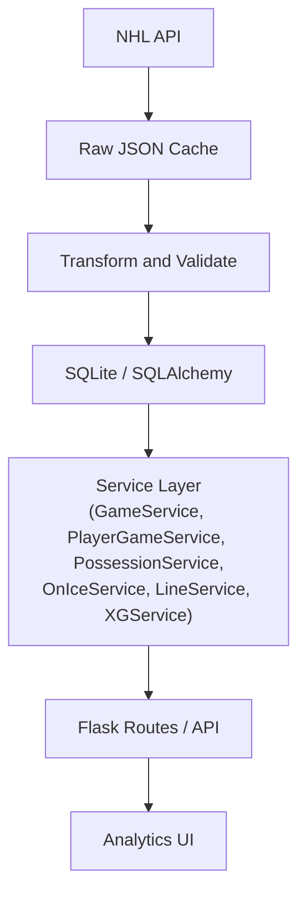

# NHL Hockey Analytics Platform (Hockey-Ops)

[](https://github.com/david-turnbull/Hockey-game-analyzer/actions/workflows/tests.yml)

**Branch Status:** v1.0 Release Candidate

---

### What it is
An NHL post-game analysis platform.

### Who it is for
Hockey fans and analysts interested in understanding more than the traditional box score.

### What it does
- **Shot analysis** (spatial tracking and interactive shot mapping)
- **Player game analysis** (detailed stats, shift visualizer, and event logs)
- **Shift reconstruction** (re-aligning shift charts with play-by-play timelines)
- **5v5 possession** (Corsi and Fenwick metrics isolated specifically to true 5v5 play)
- **Forward lines** (trios aggregation, TOI, and on-ice goals/shots)
- **Defence pairings** (defenseman duos aggregation, TOI, and on-ice goals/shots)
- **Game-event timelines** (chronological scoring and penalty log)
- **Experimental xG** (expected goals model utilizing spatial features)

---

## Architecture & Data Flow

Below is the high-level architecture and data flow diagram of the platform.



---

## Features & Capabilities

- **NHL API Ingestion:** Downloads play-by-play and shift charts from official NHL APIs and caches raw responses locally for complete offline reproducibility.
- **Normalized Relational Schema:** Transforms nested API feeds into a structured SQLite database containing tables for Teams, Players, Games, Events, Shots, Shifts, and Game Rosters.
- **Game Overview & Timelines:** Renders boxscore stats, team comparisons, and chronological timelines of goals and penalties.
- **Interactive Shot Maps:** Visualizes shot locations on a normalized ice rink map with tooltips displaying outcome, distance, shooter, goalie, and prototype xG values.
- **True 5v5 Possession:** Computes player-specific Corsi and Fenwick metrics isolated specifically to true 5-on-5 play.
- **Shift-Based TOI Analysis:** Standardizes shift timing calculations to half-open intervals `[start, end)` to resolve touch boundaries without double-counting.
- **Line Combination Engine:** Automatically aggregates skaters into forward lines (trios) and defensive pairings (duos), tracking their collective ice time and on-ice goals/shots.
- **Prototype Expected Goals (xG):** Estimates individual shot probabilities using mathematical distance, angle, shot type, and manpower adjustments.

---

## Visual Presentation (Dashboards)

*Note: Screenshots of the user interface are currently pending generation and will be placed in the `docs/screenshots/` directory once finalized.*

### 1. Game Selector UI
Allows users to select an ingested season, team, and game from a responsive drop-down interface.
- Required Screenshot: `docs/screenshots/game_selector.png`

### 2. Game Overview Dashboard
Displays aggregated team boxscore metrics (Faceoffs, Shots, PIM, Power Plays, Prototype xG), chronological goals and penalty timelines, and team comparison charts.
- Required Screenshot: `docs/screenshots/game_overview.png`

### 3. Interactive Shot Map
Draws shot coordinates normalized so that the attacking direction is always from left to right (facing the net at `x = 89`). Filters by team, shot outcome, and strength state.
- Required Screenshot: `docs/screenshots/shot_map.png`

### 4. Player Game Page
Highlights individual skater/goalie performance stats, a chronological player event log, an interactive individual shot map, and a second-by-second shift timeline visualization.
- Required Screenshot: `docs/screenshots/player_game.png`

### 5. Line Combinations & Possession
Groups home and away skaters into forward trios and defense pairings, tracking collective time on ice, goals for/against, and shots for/against.
- Required Screenshot: `docs/screenshots/line_combinations.png`

---

## Analytical Definitions

- **Corsi (Shot Attempts):** Measures possession by counting all shot attempts (Goals + Saves + Misses + Blocks). Represents the volume of play directed toward the opponent's net.
- **Fenwick (Unblocked Shot Attempts):** Measures possession by counting unblocked shot attempts (Goals + Saves + Misses). Often used as a predictor of scoring and sustained pressure.
- **Corsi / Fenwick For Percentage (CF% / FF%):** The percentage of total shot attempts (for both teams) taken by a player's team while they are on the ice. Formula: `CF% = CF / (CF + CA) * 100`.
- **True 5v5:** Situation where both teams have exactly 5 skaters and 1 goalie on the ice. The platform excludes 4v4, 3v3, power play, penalty kill, empty-net (goalie pulled), and shootouts from true 5v5 calculations.
- **Time On Ice (TOI):** Cumulative active seconds spent on the ice. Standardized to half-open intervals `[start, end)` (i.e. `start <= t < end`), meaning a player is active at their shift start second and inactive at their shift end second.
- **Prototype Expected Goals (xG):** Heuristic probability representing the likelihood of a shot attempt scoring, based on distance, angle, shot type, and manpower adjustments.

---

## Prototype xG Heuristic Formula

The Expected Goals (xG) metric is a **non-statistical prototype heuristic** using hand-selected log-odds coefficients to estimate shot probability. It is not a machine-learning model trained on historical outcomes.

### Formula
$$log\\_odds = \beta_0 + (\beta_{dist} \times distance) + (\beta_{angle} \times |angle|) + shot\\_type\\_adj + strength\\_state\\_adj$$

$$xG = \frac{1}{1 + e^{-log\\_odds}}$$

### Coefficients and Adjustments
- **Baseline Constant ($\beta_0$):** `-1.9` (corresponds to a baseline ~13% conversion probability).
- **Distance Coefficient ($\beta_{dist}$):** `-0.035` per foot decay (farther shots are harder to score).
- **Angle Coefficient ($\beta_{angle}$):** `-0.015` per degree decay (wider angles from the center line are harder to score).
- **Shot Type Adjustments:**
  - Tip-In / Deflection: `+0.4` log-odds (redirects close to net are highly dangerous).
  - Backhand: `+0.1` log-odds (unpredictable releases).
  - Slap Shot: `-0.2` log-odds (typically taken from far distances).
- **Strength Adjustments:**
  - Attacking Power Play (e.g. PP, 5v4, 5v3): `+0.15` log-odds (increased time and space).
  - Attacking Shorthanded (e.g. SH, 4v5, 3v5): `-0.15` log-odds (lower support, rushed shots).

### Empty Net Override
If the defending team's goalie is pulled (`empty_net` is True):
$$xG = \max(0.1, 1.0 - (distance \times 0.005))$$
*(Linear decay ranging from 99% near the net to 10% from the opposite end of the rink)*

---

## Data Source & Preservation

- **API Endpoints:** Ingests live data from the NHL Gamecenter API (`api-web.nhle.com/v1/gamecenter/{game_id}/play-by-play`) and stats shift chart API (`api.nhle.com/stats/rest/en/shiftcharts`).
- **Raw Response Preservation:** All fetched JSON responses are stored locally in the `data/raw/` directory, serving as reproducible fixtures.
- **Heuristics & Normalization:** Skater counts and goalie statuses are extracted from the API's `situationCode` values (e.g., `1551` where digits represent Away Goalie, Away Skaters, Home Skaters, Home Goalie).
- *Disclaimer: This platform is for educational and analytical research purposes. It is not endorsed by or affiliated with the National Hockey League (NHL).*

---

## Setup & Running Instructions

### 1. Installation
Clone the repository and set up a Python 3.12 virtual environment:
```powershell
python -m venv .venv
.venv\Scripts\Activate.ps1
pip install -r requirements.txt
```

### 2. Database Initialization & Seeding
Create the database tables and seed local team/player structures:
```powershell
python scripts/initialise_database.py
```

### 3. Ingest NHL Game Data
Ingest a game (for example, Calgary Flames game `2023020007`) using cached JSON or downloading fresh data:
```powershell
python scripts/ingest_game.py 2023020007
```

### 4. Running the Web Server
Launch the Flask development server:
```powershell
python run.py
```
Open [http://127.0.0.1:5000/](http://127.0.0.1:5000/) in your web browser to use the dashboards.

---

## Testing & Continuous Integration

### Automated Test Suite
The codebase includes comprehensive unit and regression tests written using `pytest`. These cover pipeline normalization, data quality checkers, shift time boundaries, line combinations, possession metrics, and expected goals math.

To run the tests locally:
```powershell
pytest
```

### Continuous Integration (CI)
The project utilizes GitHub Actions for continuous integration. The CI workflow is defined in `.github/workflows/tests.yml` and is configured to trigger automatically on:
- Pushes to the `main` or `master` branches.
- Pushes directly to the `v1.0` release candidate branch.
- Pull requests targeting `main`, `master`, or `v1.0`.

Each CI run spawns a clean Ubuntu environment, installs Python 3.12, builds project dependencies from `requirements.txt`, and executes `pytest` automatically to validate the code changes before merging.

### Run Database Integrity Diagnostics
You can also run a specialized script to verify database constraints, search for duplicate roster entries, missing GamePlayer mappings, or timing anomalies:
```powershell
python scripts/database_diagnostics.py
```

---

## Limitations

- **Public API Timing Discrepancies:** NHL public shift charts are recorded in whole seconds, causing occasional minor shift overlaps or misalignment with play-by-play events.
- **On-Ice Reconstruction:** On-ice player presence at any given second is reconstructed from shift start and end times, assuming no delays in official records.
- **Prototype xG Coefficients:** The coefficients for xG calculations are hand-selected based on domain expertise, rather than statistically fitted to historical shot outcomes.
- **Single-Season Validation:** Validated primarily on the 2023-2024 regular season. Performance on historical data or changes in NHL API formats may vary.
- **Development Deployment:** Running on a local SQLite database and Flask built-in development server; not yet configured for production scaling or cloud environments.

---

## Roadmap

- **v1.0 Release Candidate:** Correct analytical logic, standardize shift change boundaries, modularize service layer, and introduce database diagnostics.
- **v1.x (Scaling Phase):** Build schedulers for full-season ingestion, run ingestion runtime profiling, and perform database indexing/performance tuning.
- **v2.0 (ML Integration):** Gather full-season shot outcome datasets, train a logistic regression or XGBoost expected goals (xG) model, evaluate metrics (ROC-AUC, log loss, calibration curves), and introduce advanced on-ice analytics (e.g. teammate/opponent adjustments).
