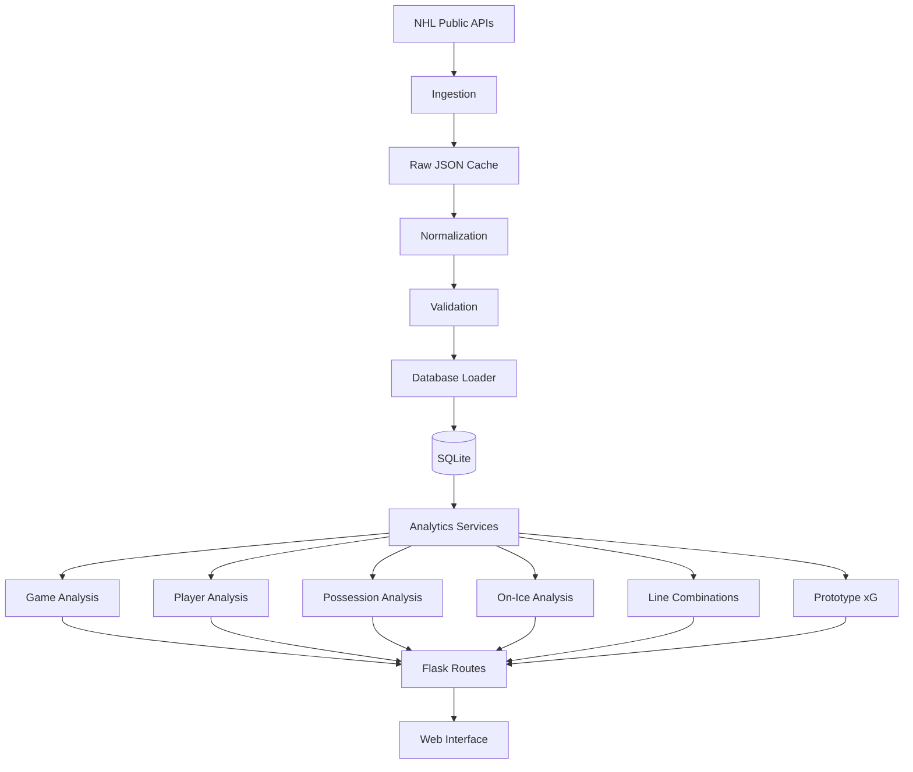

# NHL Hockey Analytics Platform

An open-source Flask application for exploring NHL games through play-by-play events, shot locations, player shifts, possession metrics, line combinations, and prototype expected-goals analysis.

The project ingests data from public NHL APIs, preserves the raw responses locally, transforms them into a normalized relational database, and exposes the results through an interactive browser-based analytics interface.

> **Project status:** v1.0 is under active development. The current release is intended for local analysis, portfolio demonstration, and continued experimentation rather than production deployment.

## Features

### Game analysis

- Browse ingested NHL games by season and team.
- Review game scores, team statistics, scoring events, and penalties.
- Explore chronological game events and scoring flow.
- Compare home and away team performance.

### Shot analysis

- Interactive rink-based shot maps.
- Normalized attacking direction for easier comparison.
- Shot outcome, location, distance, angle, shooter, goalie, and strength-state information.
- Prototype expected-goals (`xG`) values.

### Player analysis

- Game-specific player statistics.
- Time-on-ice and shift information.
- Player event timelines.
- Individual shot maps.
- Corsi and Fenwick possession metrics.

### Shift and on-ice analysis

- NHL shift-chart ingestion.
- Second-by-second reconstruction of players on the ice.
- Half-open shift intervals (`start <= t < end`) to prevent boundary double-counting.
- Forward-line and defensive-pairing identification.
- Combination TOI and on-ice goals/shots.

### Data quality

- Raw NHL responses preserved before transformation.
- Data normalization and validation pipeline.
- Shift anomaly detection.
- Database integrity diagnostics.
- Automated pytest test suite.

---

## Architecture



The application separates data acquisition, transformation, persistence, analytical logic, and presentation so that raw NHL data remains distinct from derived analytics.

---

## Data pipeline

The ingestion workflow follows:

```text
NHL API
   ↓
Raw JSON
   ↓
Normalization
   ↓
Validation
   ↓
SQLite
   ↓
Analytics services
   ↓
Flask / Jinja interface
```

Raw API responses are cached under `data/raw/`. Once a game has been downloaded, that cached response can be reused for reproducible local analysis without requesting the same data again.

---

## Data sources

The application currently uses public NHL endpoints including:

```text
https://api-web.nhle.com/v1/gamecenter/{game_id}/play-by-play
https://api.nhle.com/stats/rest/en/shiftcharts
```

The application is not affiliated with or endorsed by the National Hockey League.

NHL API structures may change without notice, so historical ingestion behaviour is not guaranteed indefinitely.

---

## Project structure

```text
Hockey-game-analyzer/
│
├── app/
│   ├── models/                 # SQLAlchemy database models
│   ├── routes/                 # Flask routes and API endpoints
│   ├── services/               # Hockey analytics/business logic
│   ├── static/                 # CSS and JavaScript
│   ├── templates/              # Jinja templates
│   ├── __init__.py             # Flask application factory
│   └── config.py               # Application configuration
│
├── data_pipeline/
│   ├── ingest/                 # NHL API ingestion
│   ├── transform/              # Raw-data normalization
│   ├── validation/             # Data-quality validation
│   ├── loaders/                # Database loading
│   └── orchestrator.py         # Pipeline orchestration
│
├── scripts/
│   ├── initialise_database.py
│   ├── ingest_game.py
│   ├── ingest_season.py
│   ├── populate_xg.py
│   └── database_diagnostics.py
│
├── tests/                      # Automated pytest suite
├── requirements.txt            # Runtime dependencies
├── requirements-dev.txt        # Development/test dependencies
└── run.py                      # Local application entry point
```

---

## Installation

### Requirements

- Python 3.12+
- Git

Clone the repository:

```bash
git clone https://github.com/david-turnbull/Hockey-game-analyzer.git
cd Hockey-game-analyzer
```

Create a virtual environment:

### Windows PowerShell

```powershell
python -m venv .venv
.venv\Scripts\Activate.ps1
```

### macOS / Linux

```bash
python3 -m venv .venv
source .venv/bin/activate
```

Install runtime dependencies:

```bash
pip install -r requirements.txt
```

For development and testing:

```bash
pip install -r requirements-dev.txt
```

---

## Environment configuration

Local configuration can be supplied using a `.env` file in the project root.

Example:

```env
ENABLE_DIAGNOSTICS=true
SECRET_KEY=replace-with-a-local-development-key
```

The `.env` file is ignored by Git and should not be committed.

### Diagnostics

The diagnostics interface is intended for development only.

When:

```env
ENABLE_DIAGNOSTICS=true
```

the developer diagnostics page is available.

When the variable is absent or set to `false`, diagnostics should not appear in the navigation and direct requests to `/diagnostics` should return `404`.

Production deployments should leave diagnostics disabled.

---

## Initialize the database

Create the local database:

```bash
python scripts/initialise_database.py
```

By default, the application uses a local SQLite database.

A different database URL can be supplied through:

```env
DATABASE_URL=...
```

---

## Ingest NHL data

### Single game

```bash
python scripts/ingest_game.py 2023020007
```

### Season

```bash
python scripts/ingest_season.py CGY 20232024
```

Replace `CGY` with the appropriate NHL team abbreviation and the season identifier with the desired NHL season.

Downloaded NHL responses are cached locally so subsequent processing can reuse the original source data.

---

## Run the application

Start the local Flask development server:

```bash
python run.py
```

Then open:

```text
http://127.0.0.1:5000/
```

The built-in Flask server is intended for local development and should not be used as a production web server.

---

## Testing

Run the complete test suite:

```bash
python -m pytest
```

Run with coverage:

```bash
python -m pytest --cov=app --cov=data_pipeline tests/
```

The suite covers application routes, database behaviour, normalization, ingestion fixtures, possession calculations, shift boundaries, line combinations, shot maps, player-game analysis, and prototype xG calculations.

---

## Analytics definitions

### Corsi

Corsi measures total shot attempts:

```text
Goals + shots on goal + missed shots + blocked shots
```

Corsi For Percentage:

```text
CF% = CF / (CF + CA) × 100
```

### Fenwick

Fenwick measures unblocked shot attempts:

```text
Goals + shots on goal + missed shots
```

Fenwick For Percentage:

```text
FF% = FF / (FF + FA) × 100
```

### True 5v5

For the application's true 5v5 calculations, both teams must have:

- five skaters;
- a goalie on the ice; and
- no power-play, penalty-kill, empty-net, or shootout situation.

### Time on ice

Shift intervals follow:

```text
start <= time < end
```

This prevents the same player from being counted twice at an exact shift-change boundary.

---

## Prototype expected goals

The current xG implementation is an experimental heuristic rather than a statistically trained machine-learning model.

It estimates scoring probability using:

- shot distance;
- shot angle;
- shot type;
- manpower situation; and
- empty-net state.

The general form is:

```text
log_odds =
    baseline
    + distance effect
    + angle effect
    + shot-type adjustment
    + strength-state adjustment

xG = 1 / (1 + exp(-log_odds))
```

The prototype exists to support the application's analytics and visualization architecture. It should not be interpreted as a validated NHL expected-goals model.

A future version is intended to replace the heuristic with a model trained and evaluated using historical NHL shot outcomes.

---

## Current limitations

The application is still under active development.

Known limitations include:

- NHL public API schemas may change.
- Shift-chart timestamps are reported at whole-second resolution.
- Player-on-ice reconstruction depends on the quality of official shift data.
- The current xG model uses hand-selected coefficients rather than fitted historical data.
- SQLite is currently used as the primary database.
- The Flask development server is not intended for public production deployment.
- Historical and multi-season validation is still being expanded.

---

## Roadmap

### v1.0

- Stable NHL game ingestion.
- Game and player dashboards.
- Interactive shot maps.
- Shift reconstruction.
- Corsi/Fenwick possession metrics.
- Line combination analysis.
- Prototype xG.
- Data-quality validation.
- Developer diagnostics.
- Automated testing.

### v1.x

- Improved onboarding and usability.
- Casual, intermediate, and advanced analytics presentation modes.
- Broader season ingestion and validation.
- Performance profiling and database indexing.
- Improved status and event presentation.
- Deployment and distribution workflow.

### v2.0

- Historically trained expected-goals model.
- Model evaluation and calibration.
- Expanded player and team analytics.
- Teammate and opponent adjustments.
- Multi-season comparative analysis.

---

## Disclaimer

This project is an independent hockey analytics and software-development project.

It is not affiliated with, sponsored by, or endorsed by the National Hockey League or any NHL club.

All NHL-related names and marks remain the property of their respective owners.
