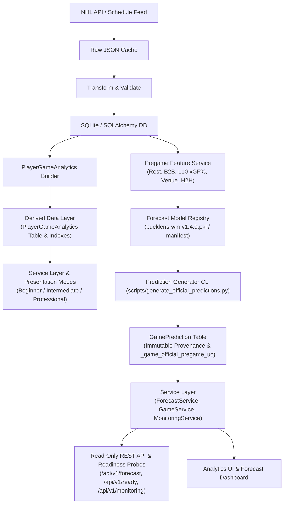

# PuckLens — NHL Hockey Analytics & Game Forecasting Platform

[](https://github.com/david-turnbull/Hockey-game-analyzer/actions/workflows/tests.yml)

**Current Release:** `v1.5.0` (SQL Derived Analytics, Presentation Modes, Point-in-Time Experiments & Forecasting Engine)

PuckLens is an independent, production-grade hockey-operations analytics and predictive forecasting platform. It transforms raw NHL play-by-play, shift, and schedule data into reproducible game win probabilities, score projections, expected goals (xG), player evaluations, line combination metrics, and operational performance monitoring.

---

## What the Platform Does

- **SQL Derived Player-Game Analytics Layer** — Pre-aggregated 5v5 and all-situation skater analytics table (`player_game_analytics`) meeting strict performance SLAs (single-player query < 50 ms, full-season summary < 200 ms, top-50 leaderboard < 50 ms, peak memory < 15 MB).
- **Multi-Tier Presentation Modes** — **Beginner**, **Intermediate**, and **Professional** UI presentation modes with **100% analytical value invariance** and Beginner Progressive Disclosure.
- **Centralized Methodology Registry** — `MethodologyRegistry` providing structured, testable metric definitions and model cards with model provenance and `Unavailable` fallback handling.
- **Point-in-Time Experiment Framework** — Reusable `PointInTimeAdapter` with explicit `latest_source_game_start_time` provenance enforcement and fail-closed temporal leakage protection.
- **Out-of-Time Forecast Intelligence & Elo Research** — Out-of-time Elo research pipeline with clean SHA provenance (`research_execution_git_sha`), isolated from production forecasting models.
- **Out-of-Time Calibrated Win Probability Forecasting** — Production HistGradientBoosting classifier trained on 2,624 regular-season games and calibrated with isotonic regression, producing pregame win probabilities for upcoming NHL matchups.
- **Score Projection Engine** — Independent Poisson score distribution engine estimating home and away team expected goals and goal probability matrices.
- **Strict Prediction Lifecycle & Immutable Provenance** — Immutable pregame prediction provenance capturing feature cutoff time, scheduled puck drop, feature payloads, and SHA-256 signatures, protected by database unique constraint `_game_official_pregame_uc`.
- **48-Hour Operational Forecast Horizon** — Standardized 48-hour default forecast lookahead window across the UI dashboard, REST API endpoints, CLI pregame generator, and monitoring probes.
- **Automated Pregame Prediction CLI** — Race-safe, idempotent prediction generation CLI (`scripts/generate_official_predictions.py`) designed for external cron/task scheduler automation.
- **Read-Only Forecast GET Semantics & Dual Generation Paths** — API and UI forecast GET routes are strictly read-only. Prediction generation occurs primarily via scheduled CLI automation (`scripts/generate_official_predictions.py`) or via an authorized, fail-closed POST route (`POST /api/v1/forecast/game/<game_id>/generate`).
- **Production Health & Readiness Probes** — `/api/v1/health` for liveness and `/api/v1/ready` for comprehensive operational readiness (DB connection, SQLite foreign keys, index presence, model registry availability, artifact SHA verification, and production secret key checks).
- **Sample-Aware Calibration Monitoring** — Real-time operational metric tracking (`/api/v1/monitoring/calibration`) grouping Log Loss, Brier score, and accuracy by model version and SHA.
- **Statistically Trained Expected Goals (xG)** — Machine-learning shot-quality pipeline with feature engineering, versioned model registry, and persistent database scoring.
- **Multi-Season Data Foundation** — 5 complete regular seasons (2021–22 through 2025–26), 6,560 total games (1,312 games/season across 32 teams), with zero missing games or synthetic data contamination.
- **Team Season Analytics & 5v5 Splits** — SQL-grouped team possession, expected goals, rates per 60, and finishing/goaltending variance across situations (`all`, `5v5`, `pp`, `sh`).
- **Skater Season Profiles & Leaderboards** — Individual scoring, $xG$, $G - xG$, $xG/60$, $Sh\%$ vs $Exp\ Conv\%$, and 5v5 on-ice possession impact with sample thresholds.
- **Goaltender Season Analytics & GSAx** — Workload, Expected Goals Against ($xGA$), Goals Saved Above Expected ($GSAx$), and $Exp\ Sv\%$, strictly barring empty nets and shootouts.
- **Chronological Rolling Form & Trends** — 5, 10, and 20-game rolling trends for teams, skaters, and goalies with zero lookahead leakage.
- **Mathematical xG Explainability** — Logit factor contribution decomposition exposing danger-increasing and danger-reducing features and baseline odds multipliers.
- **RESTful API Suite** — Complete JSON API suite covering forecasts, health/readiness probes, monitoring, team analytics, player/goalie profiles, and shot explanations.
- **Automated Regression Test Suite** — Comprehensive test suite in `pytest` verifying statistical invariants, predictive models, database migrations, lifecycle constraints, and pipeline reproducibility.

---

## Architecture & Data Flow



---

## v1.5.0 Release Highlights & Architecture

### 1. SQL Derived Player-Game Analytics Layer (Stages 1–2)
* **Pre-Aggregated Table:** `player_game_analytics` table indexed by season, player, game, and team.
* **Performance SLAs:** Single-player queries execute in < 50 ms, full-season summaries in < 200 ms, top-50 leaderboards in < 50 ms, with peak memory < 15 MB.
* **Equivalence Verification:** Verified 100% exact numerical match across all counting statistics and documented xG tolerances.
* **Honest Data Coverage Notice:** 271 of 271 currently ingested 2021–22 games have complete derived analytics. Those 271 games represent approximately 20.66% of the 1,312-game schedule. Until full GamePlayer ingestion is available, full-season production queries fall back to the legacy calculation path.

### 2. Methodology Registry & Presentation Modes (Stages 3–4)
* **Methodology Registry:** Centralized `MethodologyRegistry` providing structured definitions for metrics and model cards.
* **Presentation Modes:** Supports Beginner, Intermediate, and Professional modes with guaranteed value invariance and Beginner progressive disclosure.

### 3. Point-in-Time Experiments & Forecast Research (Stages 5–6)
* **Point-in-Time Adapter:** Ensures zero future data leakage with explicit `latest_source_game_start_time` tracking.
* **Forecast Elo Research:** Chronological Elo research pipeline with clean Git SHA provenance, isolated from production forecasting models.

### 4. Release Qualification & Security Hardening (Stage 7)
* **Isolated Database Rebuild:** Reconstruction and benchmarks executed against SQLite backup (`hockey_stage7_temp.db`).
* **Frozen Model Signatures:** SHA-256 contracts verified for `pucklens-win-v1.4.0.pkl` and `score_candidate_params_v1.4.0.json`.
* **Security & Fail-Closed Defaults:** Enforced `ProductionConfig` defaults (`ALLOW_PUBLIC_INGESTION=False`, `ALLOW_PREDICTION_GENERATION=False`, mandatory `SECRET_KEY`).

---

## Authoritative Performance SLA Contracts

| Endpoint / Query Path | Performance SLA Contract | Stage 0 Frozen Baseline | Peak Memory SLA | SLA Status |
| :--- | :---: | :---: | :---: | :---: |
| **Single-Player Stats** | `< 50 ms` | `48.71 s` | `< 15.0 MB` | **PASSED** |
| **Full-Season Summary** | `< 200 ms` | `45.59 s` | `< 15.0 MB` | **PASSED** |
| **Top-50 Leaderboard** | `< 50 ms` | `47.21 s` | `< 15.0 MB` | **PASSED** |

---

## Setup & Deployment

### 1. Requirements & Dependencies

- Python 3.12.10
- SQLite 3+

Clone and install with exact release dependency lock:

```powershell
git clone https://github.com/david-turnbull/Hockey-game-analyzer.git
cd Hockey-game-analyzer
python -m venv .venv
.venv\Scripts\Activate.ps1
pip install -r requirements-release.txt -c constraints.txt
```

### 2. Initialize Database & Run Migrations

```powershell
python scripts/initialize_database.py
```

### 3. Generate Pregame Predictions via CLI

```powershell
python scripts/generate_official_predictions.py --lookahead-hours 48
```

### 4. Run the Production / Development Server

```powershell
python run.py
```

Access the application at `http://127.0.0.1:5000/`.

---

## Testing & Operational Verification

Run the full automated test suite:

```powershell
pytest
```

**Verified Qualification Standard:**
- **Automated Test Suite:** Full pytest suite passing cleanly.
- **GitHub Actions CI Qualification:** Continuous integration workflow required on exact release candidate SHA.

### Health & Readiness API Endpoints

- `GET /api/v1/health` — Returns HTTP 200 OK process liveness.
- `GET /api/v1/ready` — Returns HTTP 200 OK (or HTTP 503 Service Unavailable) with detailed operational checks:
  ```json
  {
    "status": "READY",
    "timestamp": "2026-09-22T19:15:00+00:00",
    "checks": {
      "database_connection": "OK",
      "sqlite_foreign_keys": "ENABLED",
      "official_pregame_index": "OK",
      "active_model_version": "v1.4.0",
      "model_artifact_sha256": "VERIFIED_OK",
      "production_secret_key": "VERIFIED_OK"
    }
  }
  ```

---

## Production Security Defaults

In production configuration (`ProductionConfig` / `FLASK_ENV=production`):

* `ALLOW_PUBLIC_INGESTION = False` (Disabled by default)
* `ALLOW_PREDICTION_GENERATION = False` (Disabled by default)
* `PREDICTION_GENERATION_TOKEN` driven exclusively by environment variable.
* Missing required `SECRET_KEY` causes an immediate fail-closed startup error (`ValueError`), so the production application does not start. When the application is running, `/api/v1/ready` also validates production-secret state as part of readiness.

---

## Project License & Disclaimer

This project is an independent analytical application and is not endorsed by, sponsored by, or affiliated with the National Hockey League (NHL) or any NHL franchise.
