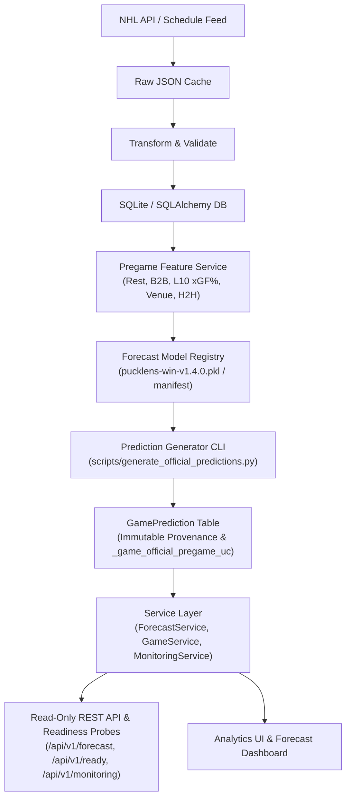

# PuckLens — NHL Hockey Analytics & Game Forecasting Platform

[](https://github.com/david-turnbull/Hockey-game-analyzer/actions/workflows/tests.yml)

**Current Release:** `v1.4.0` (Production Release & Game Forecasting Engine)

PuckLens is an independent, production-grade hockey-operations analytics and predictive forecasting platform. It transforms raw NHL play-by-play, shift, and schedule data into reproducible game win probabilities, score projections, expected goals (xG), player evaluations, line combination metrics, and operational performance monitoring.

---

## What the Platform Does

- **Out-of-Time Calibrated Win Probability Forecasting** — Production HistGradientBoosting classifier trained on 2,624 regular-season games and calibrated with isotonic regression, producing pregame win probabilities for upcoming NHL matchups.
- **Score Projection Engine** — Independent Poisson score distribution engine estimating home and away team expected goals and goal probability matrices.
- **Strict Prediction Lifecycle & Immutable Provenance** — Immutable pregame prediction provenance capturing feature cutoff time, scheduled puck drop, feature payloads, and SHA-256 signatures, protected by database unique constraint `_game_official_pregame_uc`.
- **48-Hour Operational Forecast Horizon** — Standardized 48-hour default forecast lookahead window across the UI dashboard, REST API endpoints, CLI pregame generator, and monitoring probes.
- **Automated Pregame Prediction CLI** — Race-safe, idempotent prediction generation CLI (`scripts/generate_official_predictions.py`) designed for external cron/task scheduler automation.
- **Read-Only Forecast GET Semantics & Dual Generation Paths** — API and UI forecast GET routes are strictly read-only. Prediction generation occurs primarily via scheduled CLI automation (`scripts/generate_official_predictions.py`) or via an authorized, fail-closed POST route (`POST /api/v1/forecast/game/<game_id>/generate`).
- **Production Health & Readiness Probes** — `/api/v1/health` for liveness and `/api/v1/ready` for comprehensive operational readiness (DB connection, SQLite foreign keys, index presence, model registry availability, artifact SHA verification, and production secret key checks).
- **Sample-Aware Calibration Monitoring** — Real-time operational metric tracking (`/api/v1/monitoring/calibration`) grouping Log Loss, Brier score, and accuracy by model version and SHA.
- **Statistically Trained Expected Goals (xG)** — Machine-learning shot-quality pipeline with feature engineering, versioned model registry, and persistent database scoring.
- **Multi-Season Data Foundation** — 5 complete regular seasons (2021–22 through 2025–26), 6,560 total games (1,312 games/season across 32 teams), with zero missing games or synthetic data contamination.
- **Team Season Analytics & 5v5 Splits** — SQL-grouped team possession, expected goals, rates per 60, and finishing/goaltending variance across situations (`all`, `5v5`, `pp`, `sh`).
- **Skater Season Profiles & Leaderboards** — Individual scoring, $xG$, $G - xG$, $xG/60$, $Sh\%$ vs $Exp\ Conv\%$, and 5v5 on-ice possession impact with sample thresholds.
- **Goaltender Season Analytics & GSAx** — Workload, Expected Goals Against ($xGA$), Goals Saved Above Expected ($GSAx$), and $Exp\ Sv\%$, strictly barring empty nets and shootouts.
- **Chronological Rolling Form & Trends** — 5, 10, and 20-game rolling trends for teams, skaters, and goalies with zero lookahead leakage.
- **Mathematical xG Explainability** — Logit factor contribution decomposition exposing danger-increasing and danger-reducing features and baseline odds multipliers.
- **RESTful API Suite** — Complete JSON API suite covering forecasts, health/readiness probes, monitoring, team analytics, player/goalie profiles, and shot explanations.
- **Automated Regression Test Suite** — 199 comprehensive tests in `pytest` verifying statistical invariants, predictive models, database migrations, lifecycle constraints, and pipeline reproducibility.

---

## Architecture & Data Flow



---

## v1.4.0 Forecasting Architecture & Model Engine

PuckLens v1.4.0 introduces an end-to-end predictive forecasting pipeline evaluated across 5 complete NHL regular seasons:

### 1. Stage 1 — Official Historical Backtest
* **Data Foundation:** 5 complete seasons (2021–22 through 2025–26), comprising 6,560 regular-season games (1,312/season across 32 teams).
* **Train / Calibrate / Holdout Split:**
  - Training: 2,624 games (2021–22 and 2022–23 seasons)
  - Calibration: 1,312 games (2023–24 season)
  - Frozen Out-of-Sample Holdout: 1,312 games (2024–25 season)
  - External Out-of-Time Validation: 1,312 games (2025–26 season)
* **Zero Synthetic Contamination Invariant:** 100% of training, calibration, and evaluation records are derived strictly from official NHL API feeds.

### 2. Stage 2 — Production Model Artifact & Registry
* **Win Probability Classifier:** HistGradientBoosting classifier (`pucklens-win-v1.4.0.pkl`) with Isotonic Regression calibration.
* **Score Distribution Model:** Independent Poisson score engine utilizing pregame team expected goal baselines.
* **Model Registry (`app/analytics/forecasting/model_registry.py`):** Loads active model artifacts with fail-closed error handling and SHA-256 signature verification.

### 3. Stage 3 — Official Prediction Lifecycle
* **Immutable Provenance:** Every `GamePrediction` stores `prediction_type`, `model_sha256`, `input_cutoff_time_utc`, `scheduled_start_time_utc`, `feature_payload_json`, and `feature_payload_sha256`.
* **Database Enforced Uniqueness:** Unique index `_game_official_pregame_uc` on `(game_id)` prevents duplicate or retrospective official pregame predictions.

### 4. Stage 4 — External Temporal Validation & Schedule Parity
* 100% schedule parity achieved across all 5 audited regular seasons (1,312/1,312 games each).

### 5. Stage 5 — Score Projection Validation
* Comparative validation of Independent Poisson, Negative Binomial (`alpha=0.0`), Bivariate Poisson (`lambda3=0.0`), and Dixon-Coles (`gamma=0.0543`). Independent Poisson retained as the robust production baseline.

### 6. Stage 6 — Production Automation & Operational Reliability
* Idempotent CLI pregame prediction generator (`python scripts/generate_official_predictions.py`).
* Fail-closed administrative HTTP route (`POST /api/v1/forecast/game/<game_id>/generate`).
* Read-only forecast GET routes.
* Operational readiness probe (`/api/v1/ready`) verifying database connection, SQLite foreign keys, index presence, active model loading, artifact SHA checksums, and production secrets.

### 7. Stage 7 — Release Qualification
* Environment locked in `requirements-release.txt` and `constraints.txt` (Python 3.12.10, scikit-learn 1.9.0, numpy 2.5.2).
* All 199 automated unit, integration, and performance tests passing cleanly.

---

## Authoritative Performance Benchmark

| Evaluation Dataset | Log Loss | Brier Score | Accuracy | ECE | Notes |
| :--- | :---: | :---: | :---: | :---: | :--- |
| **Original 2024–25 Frozen Holdout** | `0.6848` | `0.2431` | `57.55%` | `0.0315` | Pre-repair schedule audit |
| **Stage 4 Repaired 2024–25 Re-evaluation** | `0.6843` | `0.2429` | `57.70%` | `0.0277` | Model artifact unchanged (`63cf3cec...`); input repair shift |
| **2025–26 External Temporal Validation** | `0.6910` | `0.2479` | `54.19%` | `0.0332` | Out-of-time future season evaluation |

---

## Setup & Deployment

### 1. Requirements & Dependencies

- Python 3.12.10
- SQLite 3+

Clone and install with exact release dependency lock:

```powershell
git clone https://github.com/david-turnbull/Hockey-game-analyzer.git
cd Hockey-game-analyzer
python -m venv .venv
.venv\Scripts\Activate.ps1
pip install -r requirements-release.txt -c constraints.txt
```

### 2. Initialize Database & Run Migrations

```powershell
python scripts/initialize_database.py
```

### 3. Generate Pregame Predictions via CLI

```powershell
python scripts/generate_official_predictions.py --lookahead-hours 48
```

### 4. Run the Production / Development Server

```powershell
python run.py
```

Access the application at `http://127.0.0.1:5000/`.

---

## Testing & Operational Verification

Run the full automated test suite:

```powershell
pytest
```

**Verified Qualification Results:**
- **Local Qualification Run:** `199 passed, 0 failed, 3 warnings` in ~34.0s (Python 3.12.10, pytest 8.3.4).
- **GitHub Actions CI Qualification Run:** `199 passed, 0 failed, 24 warnings` (Python 3.12.10, pytest 8.3.4).

### Health & Readiness API Endpoints

- `GET /api/v1/health` — Returns HTTP 200 OK process liveness.
- `GET /api/v1/ready` — Returns HTTP 200 OK (or HTTP 503 Service Unavailable) with detailed operational checks:
  ```json
  {
    "status": "READY",
    "timestamp": "2026-09-18T18:35:00+00:00",
    "checks": {
      "database_connection": "OK",
      "sqlite_foreign_keys": "ENABLED",
      "official_pregame_index": "OK",
      "active_model_version": "v1.4.0",
      "model_artifact_sha256": "VERIFIED_OK",
      "production_secret_key": "VERIFIED_OK"
    }
  }
  ```

---

## Production Security Defaults

In production configuration (`ProductionConfig` / `FLASK_ENV=production`):

* `ALLOW_PUBLIC_INGESTION = False` (Disabled by default)
* `ALLOW_PREDICTION_GENERATION = False` (Disabled by default)
* `PREDICTION_GENERATION_TOKEN` driven exclusively by environment variable.
* Missing required secrets (`SECRET_KEY`) cause immediate fail-closed startup errors (`ValueError`) and 503 readiness status.

---

## Project License & Disclaimer

This project is an independent analytical application and is not endorsed by, sponsored by, or affiliated with the National Hockey League (NHL) or any NHL franchise.
