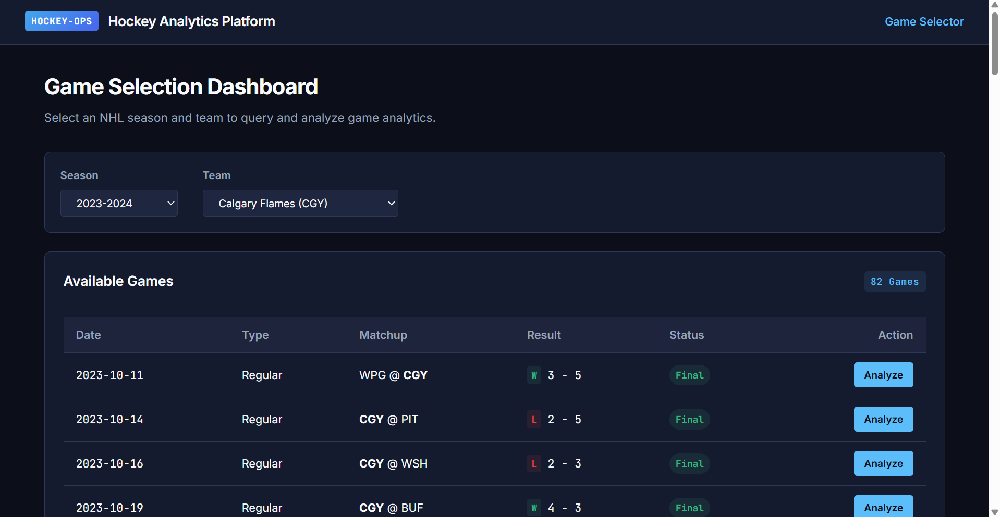
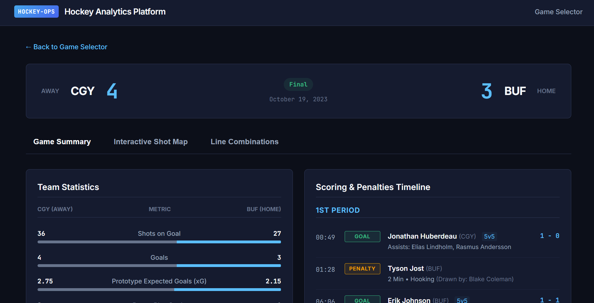
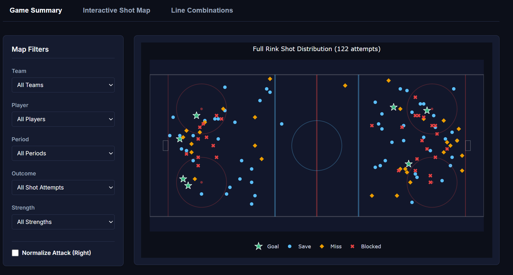
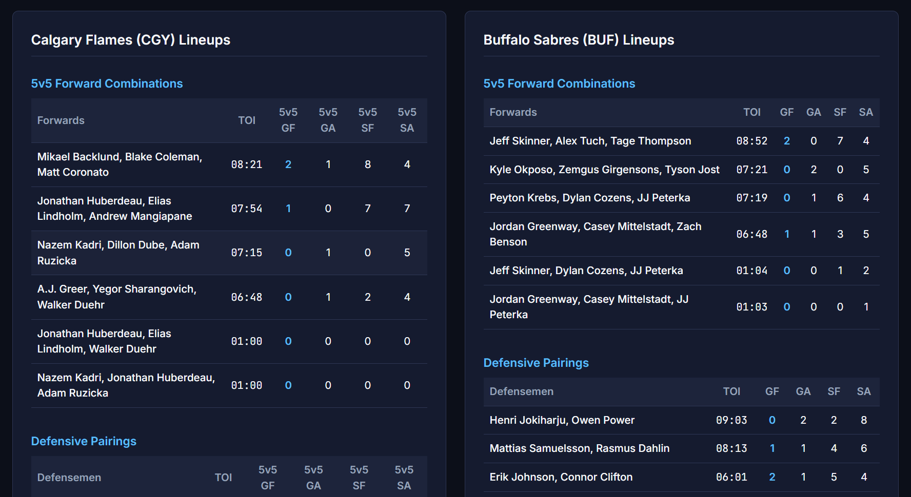
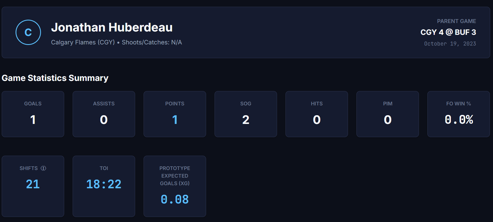
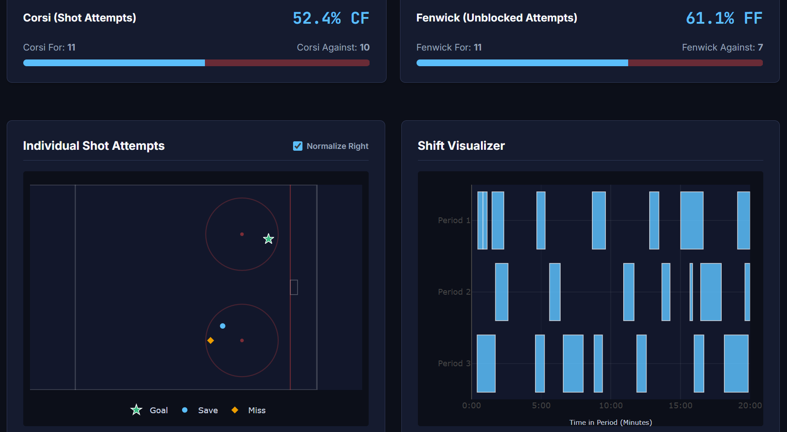
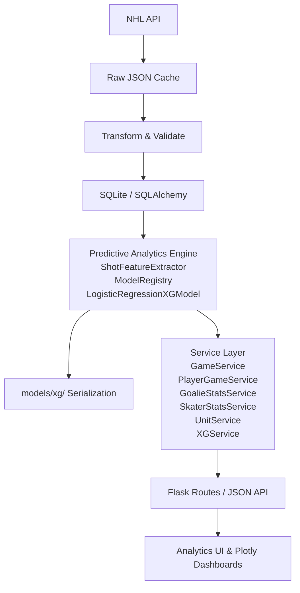

# PuckLens - NHL Hockey Analytics Platform

[](https://github.com/david-turnbull/Hockey-game-analyzer/actions/workflows/tests.yml)

**Current Release:** `v1.2.1` (Predictive Analytics Hardening)

PuckLens is an independent hockey-operations analytics platform that transforms raw NHL play-by-play and shift data into reproducible game, player, lineup, possession, spatial, and predictive analysis.

The project is designed as both a hockey analytics tool and a portfolio demonstration of data ingestion, relational modelling, machine learning pipelines, analytical service design, testing, visualization, and reproducible sports analysis.

---

## What the platform does

- **Statistically trained Expected Goals (xG)** — machine-learning shot-quality pipeline with feature engineering, versioned model registry, and persistent database scoring.
- **Interactive cumulative game xG timeline** — step-function cumulative xG progression chart with period markers and situation filtering (All, 5v5, Power Play).
- **Probability-scaled shot mapping** — spatial rink visualization where shot markers dynamically scale in radius and color intensity by expected goal probability.
- **Goaltender predictive analytics** — Expected Goals Against ($xGA$), Goals Saved Above Expected ($GSAx$), and rate stats ($GSAx/60$), strictly excluding empty nets.
- **Skater finishing analytics** — Goals Above Expected ($G - xG$), Expected Goals per 60 ($xG/60$), and Expected Conversion Rate / Shooting Percentage.
- **5v5 unit xG profiling** — Expected Goals For ($xGF$), Expected Goals Against ($xGA$), and Expected Goal Share ($xG\%$) for forward trios and defensive pairings.
- **Game analysis** — team boxscore comparisons, scoring/penalty timelines, and game-level dashboards with period-by-period xG breakdowns.
- **Shift reconstruction** — aligns NHL shift-chart data with play-by-play timing using consistent half-open interval semantics.
- **True 5v5 possession** — Corsi and Fenwick calculations restricted to complete 5v5 play.
- **5v5 forward combinations** — observed forward trios with shared TOI and on-ice GF/GA/SF/SA and xGF/xGA/xG%.
- **Defensive pairings** — defenseman duos with shared TOI and on-ice GF/GA/SF/SA and xGF/xGA/xG%.
- **Shared 5v5 combination drill-down** — Clickable forward lines and defensive pairings details dashboard showing shared shifts, on-ice events, Corsi/Fenwick/xG statistics, and Plotly shot maps.
- **Side-by-side player comparisons** — Side-by-side single-game performance comparison dashboard with situation filters and dual Plotly maps.
- **Model & data quality diagnostics** — Shot model data quality audits (coordinate geometry, goalie attribution, missing values) and relational integrity checks.
- **Standardized metric explanations** — Help tooltip hovers explaining advanced stats (Corsi, Fenwick, xG, GSAx) across the platform.
- **Full-season ingestion** — Ingest a team's regular-season schedule using the same validated game pipeline.
- **Automated regression testing and CI** — Analytical edge cases, ML reproducibility, and historical attribution covered by comprehensive tests in `pytest` and GitHub Actions.

---

## Screenshots

### Game Selection Dashboard

Select an ingested season and team, then open any available game for analysis.



### Game Summary

Game-level team statistics, scoring and penalty timeline, final score, and user-friendly game status.



### Interactive Shot Map

Explore all shot attempts by team, player, period, outcome, and strength state.



### 5v5 Forward Combinations & Defensive Pairings

Observed 5v5 forward trios are shown when they record at least 1:00 of shared true-5v5 TOI. Defensive pairings are reported separately.



### Player Game Page

Player-level game statistics, TOI, possession metrics, and calibrated expected goals.



### Player Shot & Shift Visualization

Individual shot attempts and period-by-period shift deployment.



---

## Architecture & Data Flow



The application intentionally separates ingestion, persistence, analytics, and presentation. Raw NHL status values and source records are preserved internally, while user-friendly presentation logic is handled separately.

---

## Features & Capabilities

### NHL API ingestion

The ingestion pipeline downloads NHL play-by-play and shift-chart data, caches the raw responses locally, transforms the feeds into relational records, validates the resulting data, and loads it into SQLite.

Core entities include:

- Teams
- Players
- Games
- Game rosters (`GamePlayer`)
- Events
- Shots
- Shifts

Historical game-roster attribution is treated as authoritative so players remain associated with the correct team for the game being analyzed, even after later trades.

### Game overview and event timeline

Each analyzed game includes:

- final score and status
- shots on goal
- goals
- shooting percentage
- faceoff percentage
- penalty minutes
- power-play goals
- expected goals (xG)
- chronological goals and penalties

### Interactive shot maps

Shot attempts can be filtered by:

- team
- player
- period
- outcome
- strength state

The rink can also normalize attack direction to make spatial comparisons easier.

### True 5v5 possession

Corsi and Fenwick calculations use reconstructed on-ice state and explicitly exclude non-5v5 situations.

Player-level possession outputs include:

- CF / CA
- CF%
- FF / FA
- FF%

### 5v5 forward combinations

The line-combination service reconstructs observed forward trios from shift data.

For a second to count as true 5v5:

- both teams must have exactly five skaters
- each side must contain exactly three recognized forwards
- each side must contain exactly two recognized defensemen
- empty-net and malformed manpower states are excluded

Forward combinations below **60 seconds** of shared 5v5 TOI are filtered out. This removes transient line-change combinations while retaining meaningful in-game line juggling.

### Defensive pairings

Defenseman duos are reconstructed from the same on-ice timeline and reported with:

- TOI
- GF
- GA
- SF
- SA

### Player game analysis

Player pages include:

- goals
- assists
- points
- shots on goal
- hits
- penalty minutes
- faceoff win percentage where applicable
- valid shifts
- TOI
- expected goals (xG)
- 5v5 Corsi/Fenwick
- individual shot visualization
- shift visualization

---

## Analytical Definitions

### Corsi

Corsi measures all shot attempts:

- goals
- saved shots
- missed shots
- blocked shots

For percentage:

```text
CF% = CF / (CF + CA) × 100
```

### Fenwick

Fenwick measures unblocked shot attempts:

- goals
- saved shots
- missed shots

For percentage:

```text
FF% = FF / (FF + FA) × 100
```

### True 5v5

A true-5v5 second requires complete five-skater deployment for both teams. Power plays, penalty kills, 4v4, 3v3, empty-net situations, and shootouts are excluded.

### Time on Ice

Shift matching uses half-open intervals:

```text
[start, end)
```
A player is active at the shift start second and inactive at the shift end second. This avoids double-counting players at exact shift-change boundaries.

---

## Expected Goals (xG) Predictive Analytics Engine

PuckLens v1.2 transitions from a descriptive heuristic prototype to a fully trained, validated, and reproducible **machine learning Expected Goals (xG)** pipeline.

The model estimates the probability ($0.0 \le xG \le 1.0$) that an unblocked shot attempt (goal, save, or miss) results in a goal based on spatial geometry, shot release characteristics, manpower situation, and sequential play-by-play dynamics.

> **Independent Attribution Notice:** PuckLens Expected Goals is an independently developed statistical model engineered for this platform. It is not affiliated with, sponsored by, or endorsed by the National Hockey League (NHL), NHL EDGE, Sportlogiq, or any commercial analytics vendor.

### 1. Model Architecture & Training Methodology

- **Population**: 14,262 unblocked regular-season NHL shot attempts extracted from 162 cached NHL regular season games (2023–2024 season). Shootout attempts are excluded.
- **Chronological Split Strategy**: Games are split chronologically (70% train / 15% validation / 15% test) to prevent temporal data leakage:
  - **Train**: 113 games (9,860 shots, 690 goals; 7.00% goal rate)
  - **Validation**: 24 games (2,176 shots, 157 goals; 7.22% goal rate)
  - **Held-Out Test**: 25 games (2,226 shots, 147 goals; 6.60% goal rate)
- **Active Model (`pucklens-xg-v1`)**: Standardized Logistic Regression (`pucklens-xg-logistic`, version `1.0.0`) with one-hot categorical encoding and robust fallback handling.

### 2. Feature Engineering & Spatial Geometry

All coordinates are symmetrically mapped to the attacking net at $(89, 0)$ such that shot geometry is invariant to attack direction and period. Features are restricted strictly to information available prior to or at shot release (zero look-ahead bias):

| Category | Features | Description |
| :--- | :--- | :--- |
| **Spatial Geometry** | `distance`, `angle` | Euclidean distance (ft) and absolute angle (deg) to net center $(89, 0)$. |
| **Shot Context** | `shot_type`, `strength_state` | One-hot encoded shot release type and manpower state (`EV`, `PP`, `SH`). |
| **Game Context** | `score_differential`, `period`, `period_seconds`, `is_home` | Score deficit/lead, period timing, and home ice advantage. |
| **Sequential Dynamics** | `is_rebound`, `is_rush`, `is_turnover`, `is_after_faceoff`, `is_lateral_movement` | Temporal and spatial delta from preceding event (rebounds within $\le 3$s, rushes $\ge 40$ft in $\le 4$s, turnovers within $\le 4$s, faceoffs within $\le 4$s, lateral angle shifts $\ge 25^\circ$). |
| **Net State** | `empty_net` | Binary indicator for pulled goaltender situations. |

### 3. Candidate Selection & Held-Out Test Evaluation

Candidate models were evaluated and compared strictly on the chronological validation set (2,176 shots, 24 games) using Validation Log Loss as the primary decision metric, keeping the held-out test set completely untouched during selection:

- **Validation Selection**: Logistic Regression achieved lower validation log loss (0.2325 vs 0.2328) and superior calibration compared to gradient boosting.
- **Production Retraining (Option B)**: The selected Logistic Regression configuration was refitted on the combined training and validation set (12,036 shots across 137 games).
- **Final Benchmark**: The retrained model was evaluated once on the untouched held-out test set (2,226 shots across 25 games):

| Evaluation Metric | Production Model (`pucklens-xg-logistic` v1.0.0) | Target Direction |
| :--- | :--- | :--- |
| **Test Log Loss** | **0.2127** | Lower is better |
| **Test Brier Score** | **0.0563** | Lower is better |
| **Test ROC AUC** | **0.7493** | Higher is better |
| **Total Expected Goals** | **150.44** | Target: 147.0 Actual Goals (+2.3% delta) |
| **Expected Goal Rate** | **6.76%** | Target: 6.60% Actual |

For comprehensive diagnostic breakdowns across distance brackets, calibration curves, and feature importances, see the [PuckLens xG Model Card](docs/models/xg_v1.md).

### 4. Application Integration & Downstream Metrics

- **Goaltender Predictive Analytics**:
  - **Expected Goals Against ($xGA$)**: Cumulative expected goal probability faced by the goalie.
  - **Goals Saved Above Expected ($GSAx = xGA - GA$)**: Shot-quality adjusted goaltender performance.
  - **$GSAx/60$**: Rate metric per 60 minutes of ice time.
  - *Safety Rule*: Empty-net attempts (`empty_net == True`) and shootout attempts are strictly excluded from goalie $xGA$ to avoid penalizing goaltenders for empty-net goals against while pulled.
- **Skater Finishing Analytics**:
  - **Goals Above Expected ($G - xG$)**: Individual finishing impact relative to league-average shooter expectation.
  - **$xG/60$**: Expected goals generation rate per 60 minutes of individual TOI.
  - **Expected Goal Conversion Rate**: Expected goals per unblocked shot attempt ($xG / \text{Unblocked Attempts} \times 100$).
- **Line & Pairing Combinations**:
  - True 5v5 forward trios and defensive pairings report $xGF$, $xGA$, $xG\%$, $xGF/60$, and $xGA/60$.
- **Cumulative Game xG Timeline**:
  - Interactive Plotly step chart plotting home and away cumulative expected goals over 60+ minutes with situation filtering (`All`, `5v5`, `Power Play`).
- **Probability-Scaled Shot Maps**:
  - Rink shot markers scale dynamically in radius and color intensity (ice blue for low danger up to intense scarlet for high danger) with hover tooltips displaying model version, xG probability, distance, and sequence flags.

### 5. CLI Model Management & Persistence

- **Model Training**:
  ```powershell
  python scripts/train_xg.py
  ```
  Runs chronological splits, evaluates candidates strictly on validation log loss, refits on train+val (Option B), benchmarks once on the untouched test set, and serializes the model and rich metadata to `models/xg/xg_v1.pkl` and `models/xg/metadata.json`.
- **Database Backfill**:
  ```powershell
  python scripts/backfill_xg.py
  ```
  Applies schema migrations (`Shot.model_name`, `Shot.model_version`, `Shot.prediction_method`) and updates stored predictions and provenance across all existing shots.

---

## Data Source & Preservation

The project uses NHL public data endpoints, including:

- NHL Gamecenter play-by-play
- NHL shift-chart data

Raw responses are cached under `data/raw/` so ingestion can be reproduced without repeatedly downloading the same source records.

The application preserves source values where practical. For example, the NHL game-state value `OFF` remains stored internally while the UI displays the user-friendly status `Final`.

> **Disclaimer:** This project is an independent educational and analytical project. It is not endorsed by, sponsored by, or affiliated with the National Hockey League or any NHL club.

---

## Setup

### Requirements

- Python 3.12
- `pip`
- SQLite

### 1. Clone the repository

```powershell
git clone https://github.com/david-turnbull/Hockey-game-analyzer.git
cd Hockey-game-analyzer
git checkout v1.2
```

### 2. Create a virtual environment

```powershell
python -m venv .venv
.venv\Scripts\Activate.ps1
```

macOS / Linux:

```bash
python3 -m venv .venv
source .venv/bin/activate
```

### 3. Install dependencies

```powershell
pip install -r requirements.txt
```

### 4. Initialize the database

```powershell
python scripts/initialize_database.py
```

By default, the application uses a local SQLite database.

A different database URL can be supplied through:

```env
DATABASE_URL=...
```

---

## Data Ingestion

### Ingest one game

```powershell
python scripts/ingest_game.py 2023020007
```

### Ingest part of a season

Useful for testing the pipeline before running a full season:

```powershell
python scripts/ingest_season.py CGY 20232024 --limit 5
```

### Ingest a full team season

```powershell
python scripts/ingest_season.py CGY 20232024
```

Season values use the NHL `YYYYYYYY` convention:

```text
2023-24 → 20232024
2024-25 → 20242025
```

If a fresh download is specifically required instead of using the local raw cache:

```powershell
python scripts/ingest_season.py CGY 20232024 --refresh
```

---

## Run the Web Application

```powershell
python run.py
```

Then open:

```text
http://127.0.0.1:5000/
```

---

## Testing

Run the complete test suite:

```powershell
pytest
```

The suite includes unit and regression coverage for areas such as:

- ingestion normalization
- historical roster attribution
- data quality checks
- shift-change boundaries
- half-open `[start, end)` semantics
- true 5v5 possession
- on-ice reconstruction
- forward-combination detection
- 59-second exclusion / 60-second inclusion
- game-status display mapping
- average-shift calculations
- predictive Expected Goals machine-learning mathematics and calibration
- feature engineering spatial geometry and coordinate normalization
- sequential context extraction (rebounds, rushes, turnovers, faceoffs)
- goalie GSAx and skater G-xG calculations
- model registry fallback and serialization
- database schema persistence and integrity checks

The repository also uses GitHub Actions to execute the test suite in a clean Python environment.

Do not rely on a hard-coded test count; the suite is expected to grow as regressions are discovered and fixed.

---

## Database Diagnostics

Run the integrity checker with:

```powershell
python scripts/database_diagnostics.py
```

Diagnostics include checks for:

- orphan roster records
- missing `GamePlayer` relationships
- shift/team mismatches
- timing anomalies
- shot model data quality (coordinate anomalies, missing shooter/goalie attribution, coordinate normalization)
- database integrity issues

Diagnostics are intended for development, verification, and audit purposes, accessible via the CLI script or the web interface at `/diagnostics`.

---

## Known Limitations

- **Public API timing precision:** NHL shift charts use whole-second timing, which can produce occasional minor alignment ambiguity at shift boundaries.
- **On-ice reconstruction:** Player presence is reconstructed from recorded shift start/end times and therefore inherits any source-data timing errors.
- **Play-by-play tracking resolution:** While the v1.2 xG model incorporates spatial geometry, shot type, strength, and sequence context, public NHL play-by-play feeds lack optical tracking data (exact skater speed, passing velocity, stick blade orientation, and screening defender proximity).
- **Historical coverage:** The project has been validated primarily against recent NHL data and may require adaptation if historical API formats differ.
- **Local deployment:** The current application uses SQLite and the Flask development workflow rather than production cloud infrastructure.
- **Forecasting:** The platform currently analyzes observed games and retrospective predictive shot quality; forward next-game win forecasting is planned future work.

---

## Roadmap

### v1.0 — Game & Player Analytics Foundation (Completed)

- reproducible NHL ingestion pipeline
- relational game/player/shift data model
- historical roster attribution
- game summary dashboard
- interactive shot map
- player game analysis
- true 5v5 Corsi/Fenwick
- 5v5 forward combinations
- defensive pairings
- shift visualization
- automated regression testing
- full-team-season ingestion

### v1.1 — Exploration & Usability (Completed)

- event overlays on the timeline
- interactive shared forward line & defensive pairing detail views
- side-by-side player comparison dashboard
- standardized metric explanations and hover tooltips
- UI responsive and accessibility refinements

### v1.2 — Predictive Analytics Upgrade (Completed)

- statistically trained and calibrated Expected Goals (xG) machine learning pipeline
- chronological train/val/test split across 162 NHL games (14,262 unblocked shots)
- versioned model registry and metadata serialization (`models/xg/`)
- database schema persistence (`Shot.model_version`) with automated backfill
- goaltender predictive metrics: $xGA$, $GSAx$, and $GSAx/60$ (excluding empty nets)
- individual skater finishing metrics: $G - xG$, $xG/60$, and $xSh\%$
- 5v5 forward trios and defensive pairings $xGF$, $xGA$, and $xG\%$
- cumulative game xG timeline step chart with situation filters
- probability-scaled rink shot maps with danger-level color gradients and rich tooltips
- shot model data quality integrity checks in diagnostics suite
- comprehensive model card documentation (`docs/models/xg_v1.md`)
- automated regression and predictive unit tests passing

### v1.2.1 — Predictive Analytics Hardening (Current)

- **inviolable blocked shots invariant**: blocked attempts (`outcome == 'Blocked'`) are strictly ineligible for xG (`Shot.xg = NULL`), preserving Corsi while barring blocked shots from receiving or contributing to any xG or Fenwick/unblocked-attempt-derived metrics
- **validation Log Loss candidate model selection**: strictly isolating held-out test data until single final evaluation
- **production retraining (Option B)**: refitting selected candidate on combined train and validation partitions before single test benchmark
- **sequential coordinate frame consistency**: unified attacking transform helper (`get_attacking_coordinate_transform`) for net-angle changes while preserving raw Euclidean distance deltas
- **training/serving missing-data standardization**: authoritative `ShotFeatureExtractor` with explicit `'UNKNOWN'` categories and neutral coordinate imputation
- **deterministic offline metadata testing**: frozen test fixtures proving canonical season roster precedence over play-by-play defects without live network dependencies
- **runtime provenance & pre-deserialization safety**: recording `joblib_version`, `python_version`, `platform`, and `git_commit` with pre-load version compatibility checks
- **comprehensive 3-part prediction provenance**: storing `prediction_method`, `model_name`, and `model_version` independently
- **separate shot denominator semantics**: actual shooting percentage (shots on goal) vs expected goal rate (unblocked attempts)

### Future Modelling (v1.3+)

- season-level multi-game rolling xG and GSAx trend analysis
- Bayesian regression for individual finishing talent separation from variance
- next-game win probability and score margin forecasting models
- player impact regularization (e.g. RAPM / Ridge regression on shift data)

---

## Project Status

`v1.2.1`

The emphasis of v1.2 and v1.2.1 is **delivering a rigorously validated predictive analytics engine**, elevating PuckLens from descriptive boxscores to methodologically sound, calibrated expected goals, goaltender evaluation, and lineup shot-quality analysis.
